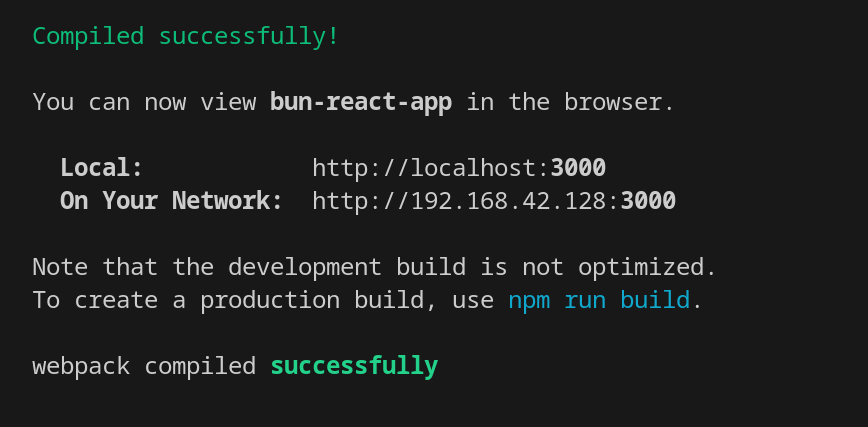
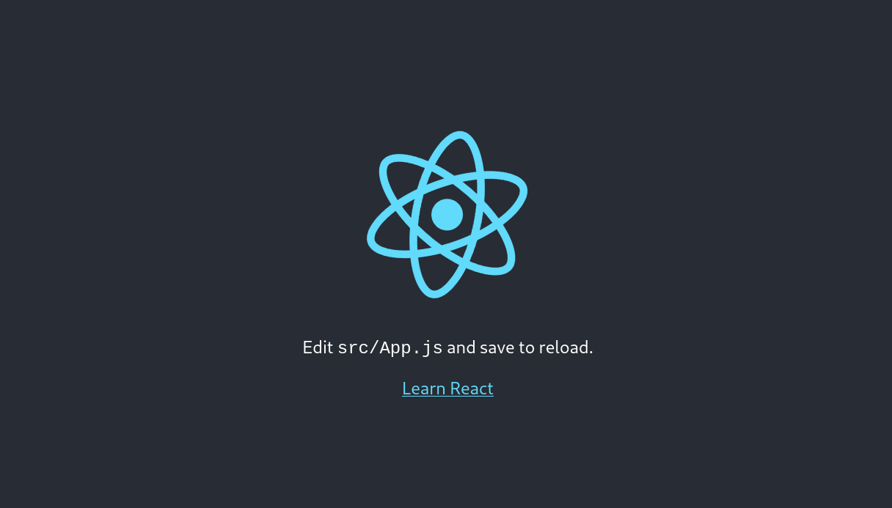

<center> <h1>Bun + React Boilerplate</h1> </center>
<div style="display: flex; justify-content: center;">
    
    
</div>

## Installation:

**_NOTE:_**: npm must be installed
```bash
curl https://bun.sh/install | bash
exec /usr/bin/zsh
bun -v
bun create react-app [app name]
```
## Start:
```bash
cd [app name]
bun react-scripts build
```
**_NOTE:_** The "bun dev" command has been removed and is considered obsolete as of today

## Result:

After running the above commands, your web application should have successfully deployed to http://localhost:3000



